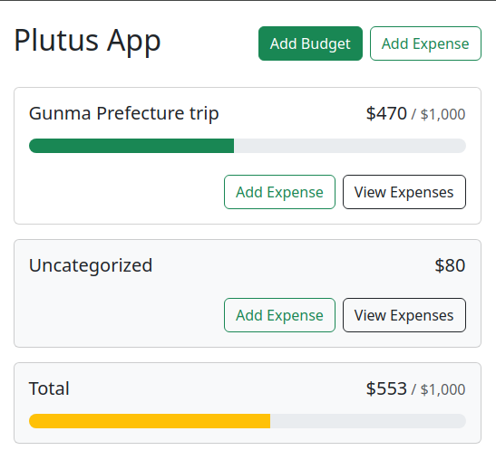

# Plutus App

## Table Of Contents

- [About](#about)
- [Description](#description)
- [Features](#features)
- [Demo](#demo)
- [Stack](#stack)

## About

A spartan budget web application.

The name 'Plutus' derives from 'Plutus', the Ancient Greek god of wealth.

## Description

The objective is to learn fundamentals React features especially components and Hooks.

## Features

## Demo

https://plutusbudget.vercel.app/

## Stack

- React 18:
  - `uuid` library
- Vite 5
- Bootstrap 5
